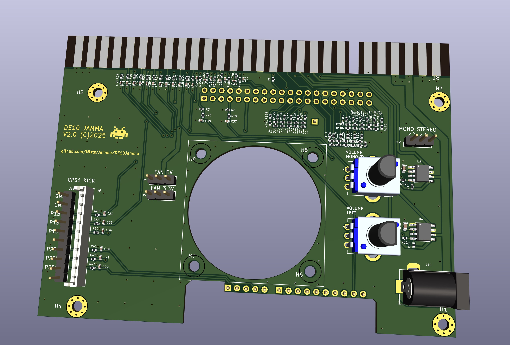

# DE10Jamma

JAMMA/NeoGeo MVS audio, video & control IO for DE10-Nano.

[https://github.com/MisterJamma/DE10Jamma](https://github.com/MisterJamma/DE10Jamma)

Discussion thread: [https://www.atari-forum.com/viewtopic.php?f=120&t=38793](https://www.atari-forum.com/viewtopic.php?f=120&t=38793)

## Description

### Overview
DE10Jamma allows a DE10-Nano board to be connected directly to an arcade cabinet as simply as possible. USB and HDMI serial interfaces are not used, in order to remain as close as possible to the original arcade hardware and avoid unnecessary cost or complexity.

Pull-down resistors on AUDIO_L and AUDIO_R pins allow this board to be detected and coexist with other MiSTer hardware using common rbf files for the cores. See [this commit](https://github.com/MisterJamma/Arcade-GnG_MiSTer/commit/6c7786a7f790a5277f337f6b245e99f6ca4c25ff).

##### Future Developments
Future developments in RTL and software to more fully support DE10Jamma

1. Allow player controls to be used in the OSD.

### Inputs
Inputs are [RC filtered](https://wiki.neogeodev.org/index.php?title=CRE401) to give EMI protection to the FPGA.

No multiplexing, polling or debouncing of the inputs ensures **zero** additional latency & jitter. Cabinet switches are presented to arcade cores exactly as they would be on a real arcade PCB. Arcade cores will include necessary debouncing either in replicated hardware of the original PCB, or in software running on that hardware. When buttons are passed to the ARM host CPU for controlling the UI & selecting arcade cores, the inputs should debounced appropriately in hardware or software.

### Audio Output
2 pole RC filters convert PWM output from DE10-Nano to analog signal. Mono/Stereo jumper JP1 allows stereo signal for MVS wired cabinets, or mono signal for JAMMA wired cabinets. With no jumper fitted, there will be no audio output for the left channel.

2 channel power amplifier drives the speaker loads.

### Video Output
Composite sync is generated by DE10-Nano.

Three 6bit R-2R DACs convert the digital output from DE10-Nano to analog RGB. A single 2R value used in parallel to generate the R value with tighter tolerance. Part-to-part tolerance is typically significantly better than absolute part tolerance, so using a single 2R value for all resistors in the DAC should improve linearity.

No additional latency or incompatibility from HDMI logic and low quality HDMI converters. Resistive DACs are commonly used on arcade PCBs, and allow the original odd resolutions & refresh rates to be supported correctly. Output level is not noticeably lower than a NeoGeo MVS, and well within adjustment range on arcade monitors.

### DC Power Output
DC power output is provided for the DE10-Nano. This should be connected using a short [2.1mm male-male cable](https://www.google.com/search?q=2.1mm+male+to+male&tbm=isch), such as used to connect guitar effects pedals to a power supply.

Arcade power supplies are typically adjustable. DE10-Nano has regulation for lower voltage supplies, and should operate correctly from nominal +5v settings. If +5v rail is adjusted too high, the DE10-Nano's over-voltage protection circuitry will not allow the board to power up.

## Parts List
See BOM in fabrication outputs file

###### Notes
   1. Part numbers from [LSSC](https://lcsc.com/) are provided where possible. Values for some components do not match the schematic, and have been adjusted to reduce the number of different components.

   1. J1, J2 and J6 should be inserted into PCB from above, using DE10-Nano to set correct depth. Solder carefully from above & trim to length. Pins should protrude approximately 0.25" from the PCB

   1. J9 is only required for cabinets with 2.5mm pitch JST kick harness connector. It may also be possible to use 0.1" pitch J11 connector with existing kick harness, as the difference in pitch is minimal for a 10way connector.

   1. A 20mm deep fan running on a lower voltage is recommended for reduced noise.
